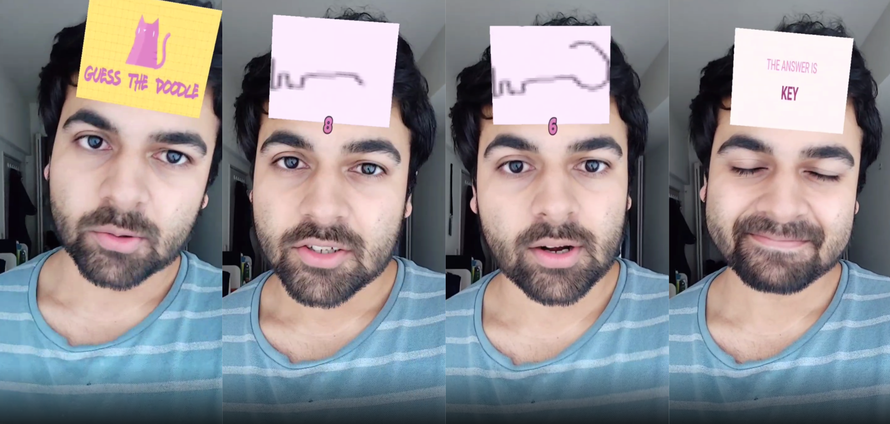
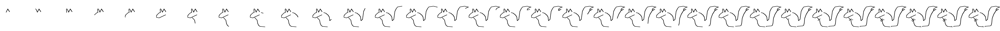
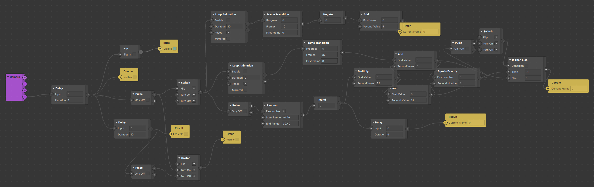

# GuessTheDoodle

Inspired by the popular instagram filter game, 
[Guess the Gibberish](https://www.facebook.com/sparkarhub/effect/view/529967291024041/),
and using the [Google Quick Draw Dataset](https://github.com/googlecreativelab/quickdraw-dataset),
**[GuessTheDoodle](https://www.facebook.com/sparkarhub/effect/view/515553142586906/)**
is a game that prompts the user to guess the doodle before it finishes drawing.

## Try out the Filter

- [Link (opens instagram)](https://www.instagram.com/ar/515553142586906/)
- [Video Demo](https://www.facebook.com/sparkarhub/effect/view/515553142586906/)

## Dev Summary

### Using the Quick Draw Dataset

The [Quick, Draw! Dataset](https://quickdraw.withgoogle.com/data) is made available by
Google, Inc. under the Creative Commons Attribution 4.0 International license.

The [quickdraw Python API](https://quickdraw.readthedocs.io/en/latest/) is a useful
tool to access the Quick Draw data - it downloads the data files as and when needed,
caches them locally and interprets them so they can be used.

The animation for drawing the doodle is ultimately a gif, however, gifs cannot be
processed directly in SparkAR. Therefore, in the instagram effect, we need to
process it as a sprite sheet.

`/quickdraw/quickdraw_gif.py` is a python script used to create sprite sheets by
processing the `QuickDrawing` objects using `Pillow` library.
Here's the generated sprite sheet for a squirrel doodle:

To incorporate multiple such sprites in the filter and selecting one at random,
the sprite sheets are stacked vertically into a single image, and the correct
doodle's coordinates can be easily determined using the index.

### Creating the filter in SparkAR

Once the resources are ready, this filter does not require any Javascript code to be
written. All the objects and textures can be put together using the UI itself, and
tutorials on how to use SparkAR can easily be found on youtube and the SparkAR community
is very helpful.

As a beginner at using SparkAR, there were a lot of things I learned from the documentation,
as per the need. As mentioned, the project uses sprite sheets to model animations,
and it is advised to keep the [sprite sheet documentation page](https://sparkar.facebook.com/ar-studio/learn/tutorials/sprite-sheets/#importing-sprite-sheets) at hand while working on the project.

The patch editor needs to account for

- 2 transitions (3 phases)
  - Intro Card (logo)
  - Question Card (doodle animation) with timer
  - Answer Card (eg. It's a SQUIRREL)
- Doodle selection
  - Randomized index
  - Sprite sheet coordinate calculation

The following is the patch editor design able to support 32 different questions:

## Requirements

- SparkAR Studio (need latest version for compatibility with Facebook platforms)
- Python
  - Pillow==8.3.1
  - quickdraw==0.2.0
